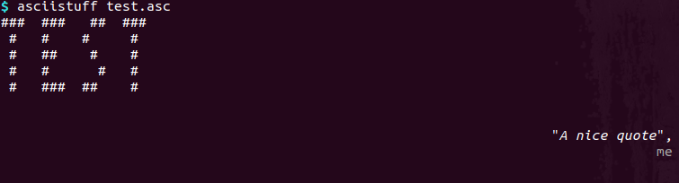

A few helper functions are available for loading ASCII arts.

## Script

A script allows to easily display an ASCII file:



## Loading an ASCII file

The function `from_file` is a shortcut to read a `.asc` file and render it as a string.

```
>>> import asciistuff
>>> print(asciistuff.from_file("test.asc"))
###  ###   ##  ###  
 #   #    #     #   
 #   ##    #    #   
 #   #      #   #   
 #   ###  ##    #   
                    

                                                        "A nice quote",
                                                                     me
                                                                               
```

## Getting a banner

The function `get_banner` is a shortcut to make an ASCII art consisting of a banner text and a logo or what is defined in the given ASCII file. By default any file with the extension `.asc`, `.jpg`, `.jpeg` or `.png`.

This function has the following options:

- `text` (string ; defaults to `None`, meaning no banner text): banner text to be displayed
- `path` (string ; defaults to `None`, meaning no additional items): path to a valid file (ASCII file or image) or folder in which a valid file shoud be searched for
- `img_ext` (tuple ; defaults to JPG and PNG extensions): list of Pillow-compatible image extensions
- `styles` (dictionary ; default is empty): 

```
>>> import asciistuff
>>> print(asciistuff.get_banner("test"))
                                                                               
                                                                               
                               #              #                                
                              ####  ##   ### ####                              
                               #   #  # #     #                                
                               #   #### ##    #                                
                               #   #      ##  #                                
                               #   #       #  #                                
                                ##  ### ###    ##                              
                                                                               

>>> print(asciistuff.get_banner(path="."))
###  ###   ##  ###  
 #   #    #     #   
 #   ##    #    #   
 #   #      #   #   
 #   ###  ##    #   
                    

                                                        "A nice quote",
                                                                     me
                                                                               
```

Note that, in the first case, only a text is provided and its default style is centered. In the second case, no banner text is provided but a `.asc` file was found through a random selection in the current folder, holding a banner and a quote.


## Getting a quote

The function `get_quotes` allows to get a random quote from a `quotes.csv` file that should at least contain the columns "`author`" and "`quote`".

This function has the following options:

- `folder` (string ; required): folder path to the `quotes.csv` file for selecting a random quote
- `style` (dictionary ; default is empty): styling parameters

